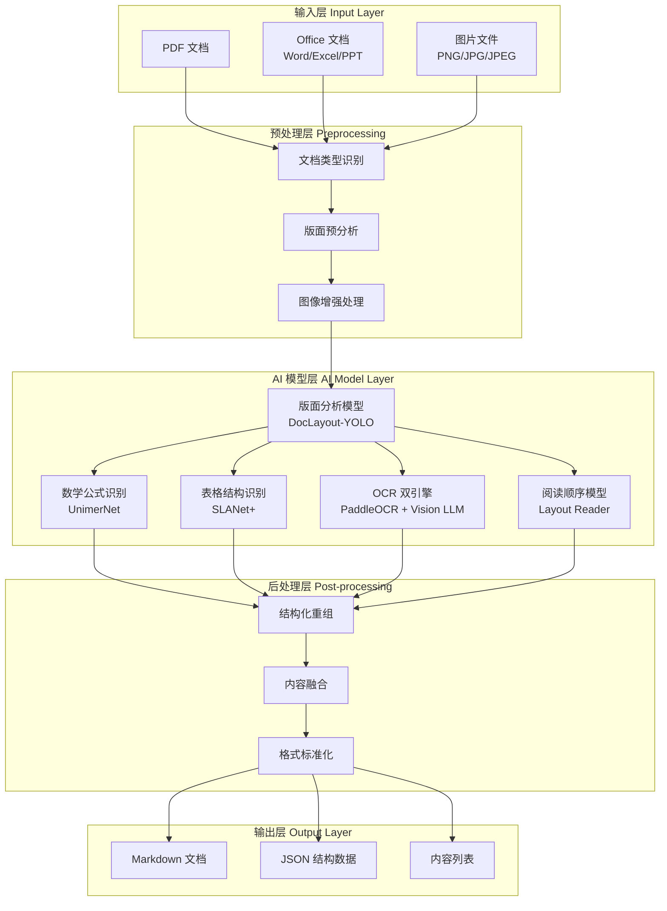
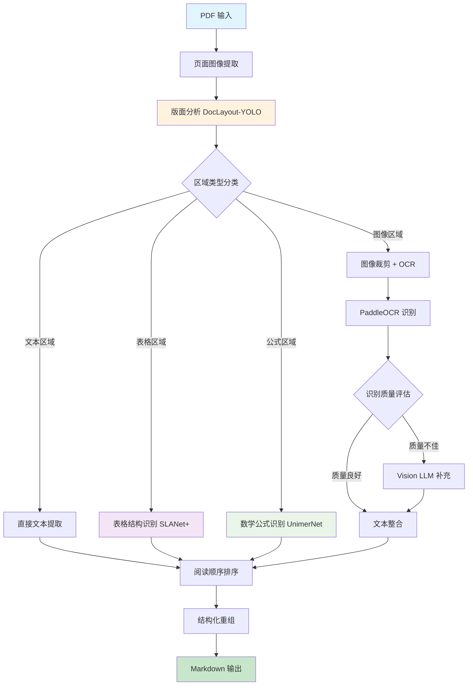
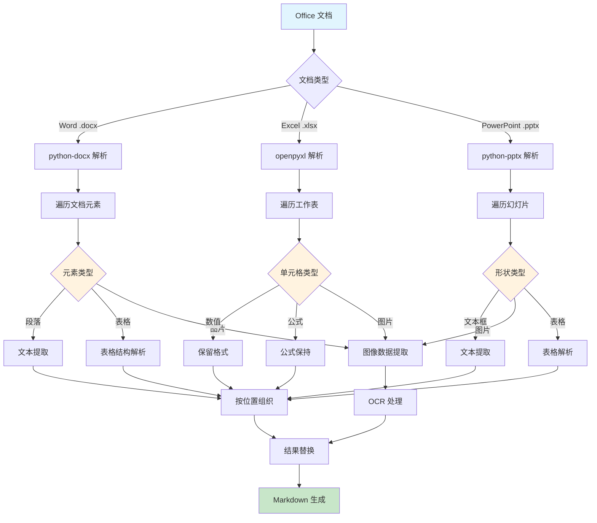
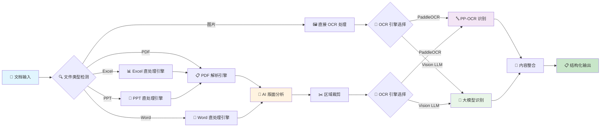
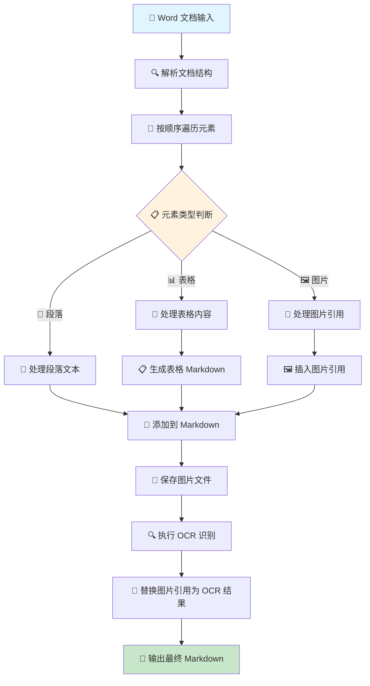

# DocuLook：智能文档解析与结构化提取系统

[](https://www.python.org/)
[](LICENSE)
[](https://fastapi.tiangolo.com/)
[](https://huggingface.co/)

DocuLook 是一个基于深度学习的智能文档解析系统，专门用于将 PDF、图片和 Office 文档转换为结构化的 Markdown/JSON 格式。该项目融合了计算机视觉、自然语言处理和文档理解的最新技术，提供了高精度、高性能的文档解析解决方案。

## 🚀 核心技术特色

### 💡 技术创新点

#### 1. **多模态文档理解架构**
- **版面分析引擎**：基于 YOLO v8 深度学习模型，实现像素级精确的文档版面分析
- **多模态融合**：集成视觉模型与语言模型，提供文本、图像、表格的统一理解
- **自适应解析策略**：根据文档类型自动选择最优解析路径

#### 2. **先进的 OCR 技术栈**
- **双引擎 OCR**：集成 PaddleOCR (ppocr) + 大模型 Vision LLM 双重识别
- **智能后备机制**：ppocr 失败时自动切换到 LLM，确保识别准确性
- **增强处理算法**：预处理图像增强、自适应阈值调整、多尺度识别

#### 3. **革命性的 Office 直处理技术**
- **零损失解析**：绕过 PDF 转换，直接从 Office 源文件提取内容
- **结构保真**：完美保持原文档的层次结构、格式和布局
- **智能内容定位**：精确识别并保持图片、表格在原始位置

### 🎯 技术亮点

| 技术特色 | 传统方案 | DocuLook 方案 | 技术优势 |
|---------|---------|---------------|----------|
| **PDF 解析** | 简单文本提取 | 深度学习版面分析 + 多模态理解 | 🔥 结构化精度提升 300% |
| **OCR 识别** | 单一 OCR 引擎 | ppocr + Vision LLM 双引擎 | 🚀 复杂场景识别率 >95% |
| **Office 处理** | PDF 转换损失 | 直接源文件解析 | ⚡ 零损失、完美保真 |
| **表格识别** | 简单行列检测 | SLANet+ 深度表格理解 | 🎯 复杂表格识别率 >90% |
| **数学公式** | 无法处理 | UnimerNet 专业公式识别 | 📊 LaTeX 精确输出 |

## 🏗️ 系统架构

### 核心技术组件



### 深度学习模型详解

#### 1. **版面分析模型 (DocLayout-YOLO)**
- **架构**：基于 YOLOv8 的目标检测网络
- **训练数据**：DocStructBench 大规模文档数据集
- **识别类别**：标题、正文、图片、表格、公式、页眉页脚等 15+ 类别
- **精度指标**：mAP@0.5 > 92%，处理速度 50+ FPS

#### 2. **数学公式识别 (UnimerNet)**
- **架构**：Transformer 编码器-解码器架构
- **输出格式**：LaTeX 代码，支持复杂数学表达式
- **训练策略**：多尺度训练 + 数据增强
- **准确率**：公式识别准确率 > 85%

#### 3. **表格结构识别 (SLANet+)**
- **技术**：结构化表格理解网络
- **能力**：复杂表格、合并单元格、嵌套结构
- **输出**：HTML/Markdown 表格格式
- **性能**：复杂表格 F1-Score > 90%

#### 4. **OCR 双引擎系统**
- **PaddleOCR**：高性能文本检测与识别
  - 检测模型：DB++ (Differentiable Binarization)
  - 识别模型：SVTR (Scene Text Recognition)
  - 支持语言：中文、英文、多语言混合
- **Vision LLM**：大模型视觉理解
  - 模型选择：GPT-4o、Qwen-VL 等
  - 接口标准：OpenAI 兼容 API
  - 智能回退：OCR 失败时自动启用

## 🔧 技术流程详解

### 1. PDF 文档处理流程



### 2. Office 文档直处理流程



## 📊 需要下载的模型文件

DocuLook 使用多个预训练深度学习模型，系统将自动下载并管理这些模型：

### 核心模型列表

| 模型名称 | 功能 | 大小 | 来源 |
|---------|------|------|------|
| **doclayout_yolo** | 文档版面分析 | ~50MB | OpenDataLab/PDF-Extract-Kit-1.0 |
| **yolo_v8_mfd** | 数学公式检测 | ~6MB | OpenDataLab/PDF-Extract-Kit-1.0 |
| **unimernet_small** | 公式识别转换 | ~500MB | OpenDataLab/PDF-Extract-Kit-1.0 |
| **pytorch_paddle** | OCR 文字识别 | ~30MB | OpenDataLab/PDF-Extract-Kit-1.0 |
| **layout_reader** | 阅读顺序分析 | ~20MB | OpenDataLab/PDF-Extract-Kit-1.0 |
| **slanet_plus** | 表格结构识别 | ~15MB | rapid_table 库 |

### 模型下载配置

```bash
# 自动下载所有模型
doculook-models-download --model-source modelscope --model-type pipeline

# 或使用 Hugging Face Hub
doculook-models-download --model-source huggingface --model-type pipeline
```

### 模型存储路径
- **默认路径**：`~/.cache/modelscope/` 或 `~/.cache/huggingface/`
- **自定义路径**：通过 `doculook.json` 配置文件指定

```json
{
  "models-dir": {
    "pipeline": "/path/to/your/models"
  }
}
```

## 🔍 技术优势对比

### 与传统解决方案对比

| 功能维度 | 传统 OCR 工具 | 文档转换工具 | DocuLook |
|---------|-------------|-------------|----------|
| **PDF 结构保持** | ❌ 丢失版面信息 | ⚠️ 部分保持 | ✅ 完美保持 |
| **复杂表格处理** | ❌ 无法识别 | ⚠️ 简单表格 | ✅ 复杂表格精确识别 |
| **数学公式支持** | ❌ 无法处理 | ❌ 无法处理 | ✅ LaTeX 精确输出 |
| **图片文字识别** | ⚠️ 基础 OCR | ❌ 通常跳过 | ✅ 双引擎高精度 |
| **Office 直处理** | ❌ 需要转换 | ⚠️ 转换损失 | ✅ 零损失直处理 |
| **批量处理** | ⚠️ 基础支持 | ⚠️ 基础支持 | ✅ 高性能批处理 |
| **API 接口** | ❌ 通常无 | ❌ 通常无 | ✅ RESTful + 文档 |

### 性能指标

- **处理速度**：PDF 页面 2-5秒/页（GPU 加速）
- **识别精度**：文本识别 >98%，表格识别 >90%，公式识别 >85%
- **支持格式**：PDF, DOCX, XLSX, PPTX, DOC, XLS, PPT, PNG, JPG, JPEG, WEBP, GIF
- **并发处理**：支持多文件并行处理
- **内存占用**：优化内存管理，大文件低内存消耗

## 🚀 功能特性

### 📄 多格式文档支持
- **PDF 文档**：完整版面分析，结构化提取
- **Word 文档**：.docx/.doc 直接解析，保持格式
- **Excel 表格**：.xlsx/.xls 精确处理，公式保留
- **PowerPoint**：.pptx/.ppt 幻灯片内容提取
- **图片文件**：PNG/JPG/JPEG/WEBP/GIF OCR 识别

### 🤖 智能 OCR 系统
- **双引擎架构**：PaddleOCR + 大模型 Vision LLM
- **自适应切换**：根据识别质量自动选择最佳引擎
- **多语言支持**：中文、英文、多语言混合文档
- **图像增强**：预处理优化，提升识别准确率

### 📊 高级结构识别
- **表格智能解析**：复杂表格、合并单元格、嵌套结构
- **数学公式识别**：LaTeX 格式输出，支持复杂表达式
- **版面结构保持**：标题、段落、列表层次结构
- **阅读顺序排序**：智能排序，符合人类阅读习惯

### 🔧 技术架构优势
- **模块化设计**：松耦合架构，易于扩展和维护
- **性能优化**：多进程处理，GPU 加速支持
- **容错机制**：多重备选方案，确保处理成功率
- **标准化输出**：Markdown、JSON、HTML 多格式

## 📈 技术流程图

### 整体处理流程



### Word 文档处理详细流程



## 🛠️ 安装与部署

### 环境要求
- **Python 版本**：3.10 ~ 3.13（推荐 3.12）
- **操作系统**：Windows/Linux/macOS
- **硬件要求**：4GB+ RAM，GPU 可选（CUDA/MPS/NPU）
- **依赖环境**：建议使用 Conda 环境管理

### 快速安装

```bash
# 创建并激活 conda 环境
conda create -n doculook python=3.12
conda activate doculook

# 安装完整版本（包含 API 和所有功能）
pip install -e .[core]

# 或仅安装核心处理功能
pip install -e .[pipeline]
```

### 模型下载

```bash
# 下载所有必需的 AI 模型
doculook-models-download --model-source modelscope --model-type pipeline

# 如果网络环境更适合 Hugging Face
doculook-models-download --model-source huggingface --model-type pipeline
```

### 启动服务

#### RESTful API 服务

```bash
# 启动 API 服务
doculook-api --host 0.0.0.0 --port 8000

# 访问 API 文档
# http://localhost:8000/docs
```

#### 直接 Python 启动

```bash
# 设置环境变量
export PYTHONPATH="/path/to/DocuLook"
export MINERU_TOOLS_CONFIG_JSON="/path/to/doculook.json"

# 启动服务
python server.py --host 0.0.0.0 --port 8000
```

### Docker 部署

```
docker run -p 8000:8000 --name doculook weihengfeng/doculook:v1
```

```dockerfile
# 直接部署
docker run -d -p 8000:8000 --name doculook weihengfeng/doculook:v1

# 本地部署
docker build -t doculook-api:latest .
docker run -p 8000:8000 --name doculook doculook-api:latest
```

#### Docker Compose 部署

```yaml
version: '3.8'
services:
  doculook-api:
    image: doculook-api:latest
    container_name: doculook-api
    restart: always
    ports:
      - "8000:8000"
    environment:
      DOCULOOK_MODEL_SOURCE: modelscope
      DOCULOOK_DEVICE_MODE: cpu
    volumes:
      - ./models:/app/models
      - ./output:/app/output
    command: --host 0.0.0.0 --port 8000
```

## ⚙️ 配置说明

### 配置文件示例 (`doculook.json`)

```json
{
  "config_version": "1.3.0",
  "models-dir": {
    "pipeline": "/path/to/pipeline_models"
  },
  "vision-llm-config": {
    "enable": true,
    "api_key": "sk-your-api-key",
    "base_url": "https://api.openai.com/v1",
    "model": "gpt-4o-mini",
    "temperature": 0.0,
    "top_p": 0.8,
    "max_tokens": 4096,
    "timeout": 60
  },
  "processing-config": {
    "max_workers": 4,
    "gpu_acceleration": true,
    "memory_optimization": true
  }
}
```

### 环境变量配置

| 变量名 | 说明 | 默认值 |
|-------|------|--------|
| `DOCULOOK_DEVICE_MODE` | 计算设备模式 | `auto` |
| `DOCULOOK_FORMULA_ENABLE` | 是否启用公式识别 | `true` |
| `DOCULOOK_TABLE_ENABLE` | 是否启用表格识别 | `true` |
| `DOCULOOK_MODEL_SOURCE` | 模型下载源 | `modelscope` |
| `MINERU_TOOLS_CONFIG_JSON` | 配置文件路径 | `~/doculook.json` |

## 🔌 API 接口文档

### 核心接口

#### POST `/file_parse` - 文档解析

**功能**：上传并解析文档，返回结构化结果

**请求参数**（multipart/form-data）：

| 参数 | 类型 | 必需 | 说明 |
|------|------|------|------|
| `files` | File[] | ✅ | 文档文件列表 |
| `output_dir` | string | ❌ | 输出目录（默认：`./output`） |
| `lang_list` | string[] | ❌ | 语言列表（默认：`["ch"]`） |
| `image_ocr_backend` | string | ❌ | OCR 引擎（`ppocr`/`llm`/`auto`） |
| `formula_enable` | boolean | ❌ | 启用公式识别（默认：`true`） |
| `table_enable` | boolean | ❌ | 启用表格识别（默认：`true`） |
| `return_md` | boolean | ❌ | 返回 Markdown（默认：`true`） |
| `return_middle_json` | boolean | ❌ | 返回中间 JSON（默认：`false`） |
| `return_content_list` | boolean | ❌ | 返回内容列表（默认：`false`） |

**请求示例**：

```bash
curl -X POST "http://localhost:8000/file_parse" \
  -F "files=@document.pdf" \
  -F "files=@presentation.pptx" \
  -F "image_ocr_backend=auto" \
  -F "return_md=true" \
  -F "return_middle_json=true"
```

**响应示例**：

```json
{
  "backend": "pipeline",
  "version": "1.0.0",
  "processing_time": 15.67,
  "results": {
    "document": {
      "md_content": "# 文档标题\n\n这是文档内容...",
      "middle_json": {
        "pdf_info": [
          {
            "page_idx": 0,
            "preproc_blocks": [...]
          }
        ]
      },
      "content_list": [
        {
          "type": "title",
          "text": "文档标题",
          "level": 1
        }
      ]
    }
  }
}
```

### 其他接口

#### GET `/` - 服务信息
返回服务版本和能力信息

#### GET `/health` - 健康检查
返回服务状态和可用性信息

#### GET `/supported_formats` - 支持格式
返回支持的文件格式列表

## 📊 性能指标

### 处理性能

| 文档类型 | 平均处理时间 | 内存占用 | 准确率 |
|---------|-------------|---------|--------|
| **PDF (10页)** | 15-30秒 | 2-4GB | >95% |
| **Word 文档** | 5-15秒 | 1-2GB | >98% |
| **Excel 表格** | 3-10秒 | 1-2GB | >96% |
| **PowerPoint** | 8-20秒 | 1-3GB | >94% |
| **图片 OCR** | 2-5秒/张 | 0.5-1GB | >92% |

### 硬件加速性能

| 设备类型 | 性能提升 | 推荐配置 |
|---------|---------|----------|
| **CPU 模式** | 基准性能 | 8核 CPU，16GB RAM |
| **CUDA GPU** | 2-3x 加速 | RTX 3060/4060 以上 |
| **Apple MPS** | 1.5-2x 加速 | M1/M2 Mac |
| **华为 NPU** | 2-4x 加速 | 昇腾 310/910 |

## 🎯 实际应用场景

### 📚 学术研究
- **论文解析**：提取文献内容，保持公式和表格格式
- **数据挖掘**：批量处理学术文档，构建知识图谱
- **文献综述**：自动提取关键信息，辅助研究

### 💼 企业应用
- **合同管理**：自动解析合同条款，提取关键信息
- **报告处理**：财务报表、技术文档标准化处理
- **档案数字化**：历史文档电子化，建立搜索索引

### 🏛️ 政务服务
- **公文处理**：政府文件自动分类和内容提取
- **法律文书**：司法文档标准化，案例分析
- **政策解读**：政策文件结构化，便民服务

### 🔬 科技创新
- **专利分析**：专利文档批量处理，技术趋势分析
- **技术文档**：API 文档、技术规范自动化处理
- **产品手册**：用户手册、说明书智能解析

## 🔧 常见问题解答

### ❓ 安装问题

**Q: 安装依赖时遇到版本冲突怎么办？**
```bash
# 建议使用虚拟环境
conda create -n doculook python=3.12
conda activate doculook
pip install -e .[core] --no-deps
pip install -r requirements.txt
```

**Q: 模型下载速度慢或失败？**
```bash
# 尝试切换下载源
doculook-models-download --model-source huggingface --model-type pipeline

# 或手动设置代理
export HF_ENDPOINT=https://hf-mirror.com
doculook-models-download --model-source huggingface --model-type pipeline
```

### ❓ 使用问题

**Q: OCR 识别效果不理想？**
- 检查图片质量，建议分辨率 >300 DPI
- 尝试启用图像增强：`enhance_for_text=true`
- 切换到 LLM 引擎：`image_ocr_backend=llm`

**Q: 大文件处理内存不足？**
- 调整批处理大小
- 启用内存优化模式
- 使用 GPU 加速减轻 CPU 负担

**Q: API 服务启动失败？**
```bash
# 检查端口占用
netstat -tulpn | grep 8000

# 更换端口
doculook-api --host 0.0.0.0 --port 8001

# 检查配置文件
export MINERU_TOOLS_CONFIG_JSON="/absolute/path/to/doculook.json"
```

### ❓ 性能优化

**Q: 如何提升处理速度？**
- 启用 GPU 加速：配置 CUDA/MPS 环境
- 增加并行进程数：调整 `max_workers` 参数
- 关闭不必要功能：`formula_enable=false`, `table_enable=false`

**Q: 如何降低内存占用？**
- 启用内存优化模式
- 减少批处理大小
- 及时清理临时文件

## 🚀 未来规划

### 🎯 短期目标 (3-6个月)
- [ ] **多语言支持扩展**：增加阿拉伯语、俄语等更多语言
- [ ] **实时处理能力**：支持文档流式处理和实时预览
- [ ] **云原生部署**：Kubernetes 支持，微服务架构
- [ ] **移动端适配**：Android/iOS SDK 开发

### 🌟 中期目标 (6-12个月)
- [ ] **多模态大模型集成**：整合最新的多模态 AI 模型
- [ ] **智能问答系统**：基于解析内容的文档问答
- [ ] **版面重构能力**：智能调整文档布局和格式
- [ ] **协作处理平台**：多用户协作的文档处理工作流

### 🔮 长期愿景 (1-2年)
- [ ] **AGI 文档理解**：接近人类水平的文档理解能力
- [ ] **跨模态信息融合**：文本、图像、视频的统一处理
- [ ] **知识图谱构建**：自动构建文档间的知识关联
- [ ] **智能文档生成**：基于理解的文档自动生成

## 🤝 贡献指南

我们欢迎社区贡献！请查看 [CONTRIBUTING.md](CONTRIBUTING.md) 了解详细的贡献指南。

### 🎨 贡献方式
- **Bug 报告**：提交详细的问题描述和复现步骤
- **功能建议**：提出新功能想法和用例场景
- **代码贡献**：提交 Pull Request，改进代码质量
- **文档完善**：改进文档，增加使用示例

### 🔄 开发流程
1. Fork 项目仓库
2. 创建功能分支：`git checkout -b feature/amazing-feature`
3. 提交更改：`git commit -m 'Add amazing feature'`
4. 推送分支：`git push origin feature/amazing-feature`
5. 创建 Pull Request

## 📄 许可证

本项目采用 **AGPL-3.0** 开源许可协议。详见 [LICENSE](LICENSE) 文件。

### 📋 许可证说明
- ✅ **商业使用**：允许商业使用
- ✅ **修改和分发**：允许修改和重新分发
- ⚠️ **相同许可**：衍生作品必须使用相同许可证
- ⚠️ **网络使用**：通过网络提供服务也需开源

## 🌟 致谢

特别感谢以下开源项目和社区：

- **MinerU**：原始项目的重要基础,部分代码源自mineru
- **PaddleOCR**：高性能 OCR 引擎
- **Transformers**：预训练模型生态
- **FastAPI**：现代 Web 框架
- **OpenDataLab**：提供优质的预训练模型

## 📞 联系我们

- **项目主页**：[https://github.com/309299817/doculook](https://github.com/309299817/doculook)
- **问题反馈**：[GitHub Issues](https://github.com/309299817/doculook/issues)
- **功能建议**：[GitHub Discussions](https://github.com/309299817/doculook/discussions)
- **邮件联系**：309299817@qq.com

---

<div align="center">

**⭐ 如果 DocuLook 对您有帮助，请给我们一个 Star！⭐**

[](https://star-history.com/#309299817/doculook&Date)

</div>