# DocuLook: Intelligent Document Parsing and Structured Extraction System

[](https://www.python.org/)
[](LICENSE)
[](https://fastapi.tiangolo.com/)
[](https://huggingface.co/)

> **Language / 语言**: English | [中文](README_CN.md)

DocuLook is an intelligent document parsing system based on deep learning, specifically designed to convert PDF, image, and Office documents into structured Markdown/JSON formats. This project integrates the latest technologies in computer vision, natural language processing, and document understanding to provide high-precision, high-performance document parsing solutions.

## 🚀 Core Technical Features

### 💡 Technical Innovation

#### 1. **Multi-modal Document Understanding Architecture**
- **Layout Analysis Engine**: Based on YOLO v8 deep learning model, achieving pixel-level precise document layout analysis
- **Multi-modal Fusion**: Integrates vision models with language models for unified understanding of text, images, and tables
- **Adaptive Parsing Strategy**: Automatically selects optimal parsing paths based on document types

#### 2. **Advanced OCR Technology Stack**
- **Dual-Engine OCR**: Integrates PaddleOCR (ppocr) + Vision LLM for dual recognition
- **Intelligent Fallback Mechanism**: Automatically switches to LLM when ppocr fails, ensuring recognition accuracy
- **Enhanced Processing Algorithms**: Preprocessing image enhancement, adaptive threshold adjustment, multi-scale recognition

#### 3. **Revolutionary Direct Office Processing Technology**
- **Zero-Loss Parsing**: Bypasses PDF conversion, directly extracts content from Office source files
- **Structure Fidelity**: Perfectly maintains the hierarchical structure, format, and layout of original documents
- **Intelligent Content Positioning**: Precisely identifies and maintains images and tables in their original positions

### 🎯 Technical Highlights

| Technical Feature | Traditional Solutions | DocuLook Solutions | Technical Advantages |
|------------------|---------------------|-------------------|---------------------|
| **PDF Parsing** | Simple text extraction | Deep learning layout analysis + Multi-modal understanding | 🔥 300% improvement in structured accuracy |
| **OCR Recognition** | Single OCR engine | ppocr + Vision LLM dual engines | 🚀 >95% recognition rate in complex scenarios |
| **Office Processing** | PDF conversion loss | Direct source file parsing | ⚡ Zero loss, perfect fidelity |
| **Table Recognition** | Simple row/column detection | SLANet+ deep table understanding | 🎯 >90% complex table recognition rate |
| **Mathematical Formulas** | Cannot handle | UnimerNet professional formula recognition | 📊 Precise LaTeX output |

## 🏗️ System Architecture

### Core Technical Components


### Deep Learning Models Detailed

#### 1. **Layout Analysis Model (DocLayout-YOLO)**
- **Architecture**: Object detection network based on YOLOv8
- **Training Data**: DocStructBench large-scale document dataset
- **Recognition Categories**: Titles, body text, images, tables, formulas, headers/footers, and 15+ categories
- **Accuracy Metrics**: mAP@0.5 > 92%, processing speed 50+ FPS

#### 2. **Mathematical Formula Recognition (UnimerNet)**
- **Architecture**: Transformer encoder-decoder architecture
- **Output Format**: LaTeX code, supporting complex mathematical expressions
- **Training Strategy**: Multi-scale training + data augmentation
- **Accuracy**: Formula recognition accuracy > 85%

#### 3. **Table Structure Recognition (SLANet+)**
- **Technology**: Structured table understanding network
- **Capabilities**: Complex tables, merged cells, nested structures
- **Output**: HTML/Markdown table formats
- **Performance**: Complex table F1-Score > 90%

#### 4. **Dual OCR Engine System**
- **PaddleOCR**: High-performance text detection and recognition
  - Detection Model: DB++ (Differentiable Binarization)
  - Recognition Model: SVTR (Scene Text Recognition)
  - Supported Languages: Chinese, English, multilingual mixed
- **Vision LLM**: Large model visual understanding
  - Model Options: GPT-4o, Qwen-VL, etc.
  - Interface Standard: OpenAI compatible API
  - Intelligent Fallback: Automatically enabled when OCR fails

## 🔧 Technical Process Details

### 1. PDF Document Processing Flow


### 2. Office Document Direct Processing Flow


## 📊 Required Model Files

DocuLook uses multiple pre-trained deep learning models, and the system will automatically download and manage these models:

### Core Model List

| Model Name | Function | Size | Source |
|------------|----------|------|--------|
| **doclayout_yolo** | Document layout analysis | ~50MB | OpenDataLab/PDF-Extract-Kit-1.0 |
| **yolo_v8_mfd** | Mathematical formula detection | ~6MB | OpenDataLab/PDF-Extract-Kit-1.0 |
| **unimernet_small** | Formula recognition conversion | ~500MB | OpenDataLab/PDF-Extract-Kit-1.0 |
| **pytorch_paddle** | OCR text recognition | ~30MB | OpenDataLab/PDF-Extract-Kit-1.0 |
| **layout_reader** | Reading order analysis | ~20MB | OpenDataLab/PDF-Extract-Kit-1.0 |
| **slanet_plus** | Table structure recognition | ~15MB | rapid_table library |

### Model Download Configuration

```bash
# Automatically download all models
doculook-models-download --model-source modelscope --model-type pipeline

# Or use Hugging Face Hub
doculook-models-download --model-source huggingface --model-type pipeline
```

### Model Storage Path
- **Default Path**: `~/.cache/modelscope/` or `~/.cache/huggingface/`
- **Custom Path**: Specify through `doculook.json` configuration file

```json
{
  "models-dir": {
    "pipeline": "/path/to/your/models"
  }
}
```

## 🔍 Technical Advantages Comparison

### Comparison with Traditional Solutions

| Feature Dimension | Traditional OCR Tools | Document Conversion Tools | DocuLook |
|------------------|---------------------|--------------------------|----------|
| **PDF Structure Preservation** | ❌ Loses layout information | ⚠️ Partially preserved | ✅ Perfectly preserved |
| **Complex Table Processing** | ❌ Cannot recognize | ⚠️ Simple tables only | ✅ Accurate complex table recognition |
| **Mathematical Formula Support** | ❌ Cannot handle | ❌ Cannot handle | ✅ Precise LaTeX output |
| **Image Text Recognition** | ⚠️ Basic OCR | ❌ Usually skipped | ✅ Dual-engine high precision |
| **Direct Office Processing** | ❌ Requires conversion | ⚠️ Conversion loss | ✅ Zero-loss direct processing |
| **Batch Processing** | ⚠️ Basic support | ⚠️ Basic support | ✅ High-performance batch processing |
| **API Interface** | ❌ Usually none | ❌ Usually none | ✅ RESTful + Documentation |

### Performance Metrics

- **Processing Speed**: PDF pages 2-5 seconds/page (GPU accelerated)
- **Recognition Accuracy**: Text recognition >98%, table recognition >90%, formula recognition >85%
- **Supported Formats**: PDF, DOCX, XLSX, PPTX, DOC, XLS, PPT, PNG, JPG, JPEG, WEBP, GIF
- **Concurrent Processing**: Supports multi-file parallel processing
- **Memory Usage**: Optimized memory management, low memory consumption for large files

## 🚀 Features

### 📄 Multi-format Document Support
- **PDF Documents**: Complete layout analysis, structured extraction
- **Word Documents**: Direct .docx/.doc parsing, format preservation
- **Excel Spreadsheets**: Precise .xlsx/.xls processing, formula retention
- **PowerPoint**: .pptx/.ppt slide content extraction
- **Image Files**: PNG/JPG/JPEG/WEBP/GIF OCR recognition

### 🤖 Intelligent OCR System
- **Dual-engine Architecture**: PaddleOCR + Large Model Vision LLM
- **Adaptive Switching**: Automatically selects the best engine based on recognition quality
- **Multi-language Support**: Chinese, English, multi-language mixed documents
- **Image Enhancement**: Preprocessing optimization, improved recognition accuracy

### 📊 Advanced Structure Recognition
- **Intelligent Table Parsing**: Complex tables, merged cells, nested structures
- **Mathematical Formula Recognition**: LaTeX format output, supporting complex expressions
- **Layout Structure Preservation**: Title, paragraph, list hierarchical structure
- **Reading Order Sorting**: Intelligent sorting, conforming to human reading habits

### 🔧 Technical Architecture Advantages
- **Modular Design**: Loosely coupled architecture, easy to extend and maintain
- **Performance Optimization**: Multi-process processing, GPU acceleration support
- **Fault Tolerance**: Multiple backup solutions, ensuring processing success rate
- **Standardized Output**: Markdown, JSON, HTML multiple formats

## 📈 技术流程图

### 整体处理流程

```mermaid
flowchart LR
    A[📄 文档输入] --> B{🔍 文件类型检测}
    B -->|PDF| C[📋 PDF 解析引擎]
    B -->|图片| D[🖼️ 直接 OCR 处理]
    B -->|Word| E[📝 Word 直处理引擎]
    B -->|Excel| F[📊 Excel 直处理引擎]
    B -->|PPT| G[🎯 PPT 直处理引擎]

    C --> H[🧠 AI 版面分析]
    E --> H
    F --> C
    G --> C
    D --> I{🔄 OCR 引擎选择}

    H --> J[✂️ 区域裁剪]
    J --> K{🎯 OCR 引擎选择}
    I -->|PaddleOCR| L[🔤 PP-OCR 识别]
    I -->|Vision LLM| M[🤖 大模型识别]
    K -->|PaddleOCR| L
    K -->|Vision LLM| M

    L --> N[📝 内容整合]
    M --> N
    N --> O[📋 结构化输出]
    
    style A fill:#e1f5fe
    style O fill:#c8e6c9
    style H fill:#fff3e0
    style L fill:#f3e5f5
    style M fill:#e8f5e8
```



### Word 文档处理详细流程

```mermaid
graph TD
    A[📄 Word 文档输入] --> B[🔍 解析文档结构]
    B --> C[🔄 按顺序遍历元素]
    C --> D{📋 元素类型判断}
    
    D -->|📝 段落| E[📄 处理段落文本]
    D -->|📊 表格| F[🔢 处理表格内容]
    D -->|🖼️ 图片| G[🎨 处理图片引用]
    
    E --> H[📝 添加到 Markdown]
    F --> I[📋 生成表格 Markdown]
    G --> J[🖼️ 插入图片引用]
    
    I --> H
    J --> H
    H --> K[💾 保存图片文件]
    K --> L[🔍 执行 OCR 识别]
    L --> M[🔄 替换图片引用为 OCR 结果]
    M --> N[📄 输出最终 Markdown]
    
    style A fill:#e1f5fe
    style N fill:#c8e6c9
    style D fill:#fff3e0
```



## 🛠️ Installation and Deployment

### Environment Requirements
- **Python Version**: 3.10 ~ 3.13 (Recommended 3.12)
- **Operating System**: Windows/Linux/macOS
- **Hardware Requirements**: 4GB+ RAM, GPU optional (CUDA/MPS/NPU)
- **Dependency Environment**: Recommended to use Conda environment management

### Quick Installation

```bash
# Create and activate conda environment
conda create -n doculook python=3.12
conda activate doculook

# Install full version (including API and all features)
pip install -e .[core]

# Or install core processing features only
pip install -e .[pipeline]
```

### Model Download

```bash
# Download all required AI models
doculook-models-download --model-source modelscope --model-type pipeline

# If network environment is more suitable for Hugging Face
doculook-models-download --model-source huggingface --model-type pipeline
```

### Start Service

#### RESTful API Service

```bash
# Start API service
doculook-api --host 0.0.0.0 --port 8000

# Access API documentation
# http://localhost:8000/docs
```

#### Direct Python Launch

```bash
# Set environment variables
export PYTHONPATH="/path/to/DocuLook"
export MINERU_TOOLS_CONFIG_JSON="/path/to/doculook.json"

# Start service
python server.py --host 0.0.0.0 --port 8000
```

### Docker Deployment

```
docker run -p 8000:8000 --name doculook weihengfeng/doculook:v1
```

```dockerfile
# Direct deployment
docker run -d -p 8000:8000 --name doculook weihengfeng/doculook:v1

# Local deployment
docker build -t doculook-api:latest .
docker run -p 8000:8000 --name doculook doculook-api:latest
```

#### Docker Compose Deployment

```yaml
version: '3.8'
services:
  doculook-api:
    image: doculook-api:latest
    container_name: doculook-api
    restart: always
    ports:
      - "8000:8000"
    environment:
      DOCULOOK_MODEL_SOURCE: modelscope
      DOCULOOK_DEVICE_MODE: cpu
    volumes:
      - ./models:/app/models
      - ./output:/app/output
    command: --host 0.0.0.0 --port 8000
```

## ⚙️ Configuration

### Configuration File Example (`doculook.json`)

```json
{
  "config_version": "1.3.0",
  "models-dir": {
    "pipeline": "/path/to/pipeline_models"
  },
  "vision-llm-config": {
    "enable": true,
    "api_key": "sk-your-api-key",
    "base_url": "https://api.openai.com/v1",
    "model": "gpt-4o-mini",
    "temperature": 0.0,
    "top_p": 0.8,
    "max_tokens": 4096,
    "timeout": 60
  },
  "processing-config": {
    "max_workers": 4,
    "gpu_acceleration": true,
    "memory_optimization": true
  }
}
```

### Environment Variable Configuration

| Variable Name | Description | Default Value |
|---------------|-------------|---------------|
| `DOCULOOK_DEVICE_MODE` | Computing device mode | `auto` |
| `DOCULOOK_FORMULA_ENABLE` | Enable formula recognition | `true` |
| `DOCULOOK_TABLE_ENABLE` | Enable table recognition | `true` |
| `DOCULOOK_MODEL_SOURCE` | Model download source | `modelscope` |
| `MINERU_TOOLS_CONFIG_JSON` | Configuration file path | `~/doculook.json` |

## 🔌 API Documentation

### Core Interfaces

#### POST `/file_parse` - Document Parsing

**Function**: Upload and parse documents, return structured results

**Request Parameters** (multipart/form-data):

| Parameter | Type | Required | Description |
|-----------|------|----------|-------------|
| `files` | File[] | ✅ | Document file list |
| `output_dir` | string | ❌ | Output directory (default: `./output`) |
| `lang_list` | string[] | ❌ | Language list (default: `["ch"]`) |
| `image_ocr_backend` | string | ❌ | OCR engine (`ppocr`/`llm`/`auto`) |
| `formula_enable` | boolean | ❌ | Enable formula recognition (default: `true`) |
| `table_enable` | boolean | ❌ | Enable table recognition (default: `true`) |
| `return_md` | boolean | ❌ | Return Markdown (default: `true`) |
| `return_middle_json` | boolean | ❌ | Return intermediate JSON (default: `false`) |
| `return_content_list` | boolean | ❌ | Return content list (default: `false`) |

**Request Example**:

```bash
curl -X POST "http://localhost:8000/file_parse" \
  -F "files=@document.pdf" \
  -F "files=@presentation.pptx" \
  -F "image_ocr_backend=auto" \
  -F "return_md=true" \
  -F "return_middle_json=true"
```

**Response Example**:

```json
{
  "backend": "pipeline",
  "version": "1.0.0",
  "processing_time": 15.67,
  "results": {
    "document": {
      "md_content": "# Document Title\n\nThis is document content...",
      "middle_json": {
        "pdf_info": [
          {
            "page_idx": 0,
            "preproc_blocks": [...]
          }
        ]
      },
      "content_list": [
        {
          "type": "title",
          "text": "Document Title",
          "level": 1
        }
      ]
    }
  }
}
```

### Other Interfaces

#### GET `/` - Service Information
Returns service version and capability information

#### GET `/health` - Health Check
Returns service status and availability information

#### GET `/supported_formats` - Supported Formats
Returns list of supported file formats

## 📊 Performance Metrics

### Processing Performance

| Document Type | Average Processing Time | Memory Usage | Accuracy |
|---------------|------------------------|--------------|----------|
| **PDF (10 pages)** | 15-30 seconds | 2-4GB | >95% |
| **Word Documents** | 5-15 seconds | 1-2GB | >98% |
| **Excel Spreadsheets** | 3-10 seconds | 1-2GB | >96% |
| **PowerPoint** | 8-20 seconds | 1-3GB | >94% |
| **Image OCR** | 2-5 seconds/image | 0.5-1GB | >92% |

### Hardware Acceleration Performance

| Device Type | Performance Improvement | Recommended Configuration |
|-------------|------------------------|---------------------------|
| **CPU Mode** | Baseline performance | 8-core CPU, 16GB RAM |
| **CUDA GPU** | 2-3x acceleration | RTX 3060/4060 or higher |
| **Apple MPS** | 1.5-2x acceleration | M1/M2 Mac |
| **Huawei NPU** | 2-4x acceleration | Ascend 310/910 |

## 🎯 Real-world Application Scenarios

### 📚 Academic Research
- **Paper Parsing**: Extract literature content while maintaining formula and table formats
- **Data Mining**: Batch process academic documents to build knowledge graphs
- **Literature Review**: Automatically extract key information to assist research

### 💼 Enterprise Applications
- **Contract Management**: Automatically parse contract terms and extract key information
- **Report Processing**: Standardized processing of financial reports and technical documents
- **Archive Digitization**: Electronic conversion of historical documents, establishing search indexes

### 🏛️ Government Services
- **Official Document Processing**: Automatic classification and content extraction of government files
- **Legal Documents**: Standardization of judicial documents and case analysis
- **Policy Interpretation**: Structured policy documents for citizen services

### 🔬 Technology Innovation
- **Patent Analysis**: Batch processing of patent documents for technology trend analysis
- **Technical Documentation**: Automated processing of API documentation and technical specifications
- **Product Manuals**: Intelligent parsing of user manuals and instruction guides

## 🔧 Frequently Asked Questions

### ❓ Installation Issues

**Q: What to do when encountering version conflicts during dependency installation?**
```bash
# Recommend using virtual environment
conda create -n doculook python=3.12
conda activate doculook
pip install -e .[core] --no-deps
pip install -r requirements.txt
```

**Q: Model download is slow or fails?**
```bash
# Try switching download source
doculook-models-download --model-source huggingface --model-type pipeline

# Or manually set proxy
export HF_ENDPOINT=https://hf-mirror.com
doculook-models-download --model-source huggingface --model-type pipeline
```

### ❓ Usage Issues

**Q: OCR recognition results are not ideal?**
- Check image quality, recommend resolution >300 DPI
- Try enabling image enhancement: `enhance_for_text=true`
- Switch to LLM engine: `image_ocr_backend=llm`

**Q: Insufficient memory when processing large files?**
- Adjust batch processing size
- Enable memory optimization mode
- Use GPU acceleration to reduce CPU burden

**Q: API service startup fails?**
```bash
# Check port usage
netstat -tulpn | grep 8000

# Change port
doculook-api --host 0.0.0.0 --port 8001

# Check configuration file
export MINERU_TOOLS_CONFIG_JSON="/absolute/path/to/doculook.json"
```

### ❓ Performance Optimization

**Q: How to improve processing speed?**
- Enable GPU acceleration: Configure CUDA/MPS environment
- Increase parallel processes: Adjust `max_workers` parameter
- Disable unnecessary features: `formula_enable=false`, `table_enable=false`

**Q: How to reduce memory usage?**
- Enable memory optimization mode
- Reduce batch processing size
- Clean up temporary files promptly

## 🚀 Future Roadmap

### 🎯 Short-term Goals (3-6 months)
- [ ] **Multi-language Support Extension**: Add more languages like Arabic, Russian, etc.
- [ ] **Real-time Processing Capability**: Support document streaming processing and real-time preview
- [ ] **Cloud-native Deployment**: Kubernetes support, microservice architecture
- [ ] **Mobile Adaptation**: Android/iOS SDK development

### 🌟 Medium-term Goals (6-12 months)
- [ ] **Multi-modal Large Model Integration**: Integrate the latest multi-modal AI models
- [ ] **Intelligent Q&A System**: Document question-answering based on parsed content
- [ ] **Layout Reconstruction Capability**: Intelligently adjust document layout and format
- [ ] **Collaborative Processing Platform**: Multi-user collaborative document processing workflow

### 🔮 Long-term Vision (1-2 years)
- [ ] **AGI Document Understanding**: Near-human-level document understanding capability
- [ ] **Cross-modal Information Fusion**: Unified processing of text, images, and videos
- [ ] **Knowledge Graph Construction**: Automatically build knowledge associations between documents
- [ ] **Intelligent Document Generation**: Document auto-generation based on understanding

## 🤝 Contributing

We welcome community contributions! Please check [CONTRIBUTING.md](CONTRIBUTING.md) for detailed contribution guidelines.

### 🎨 Ways to Contribute
- **Bug Reports**: Submit detailed problem descriptions and reproduction steps
- **Feature Suggestions**: Propose new feature ideas and use case scenarios
- **Code Contributions**: Submit Pull Requests to improve code quality
- **Documentation Improvement**: Improve documentation and add usage examples

### 🔄 Development Process
1. Fork the project repository
2. Create a feature branch: `git checkout -b feature/amazing-feature`
3. Commit changes: `git commit -m 'Add amazing feature'`
4. Push the branch: `git push origin feature/amazing-feature`
5. Create a Pull Request

## 📄 License

This project is licensed under the **AGPL-3.0** open source license. See the [LICENSE](LICENSE) file for details.

### 📋 License Description
- ✅ **Commercial Use**: Commercial use allowed
- ✅ **Modification and Distribution**: Modification and redistribution allowed
- ⚠️ **Same License**: Derivative works must use the same license
- ⚠️ **Network Use**: Services provided through networks must also be open source

## 🌟 Acknowledgments

Special thanks to the following open-source projects and communities:

- **MinerU**: Important foundation for the original project, some code is sourced from mineru
- **PaddleOCR**: High-performance OCR engine
- **Transformers**: Pre-trained model ecosystem
- **FastAPI**: Modern web framework
- **OpenDataLab**: Providing high-quality pre-trained models

## 📞 Contact Us

- **Project Homepage**: [https://github.com/309299817/doculook](https://github.com/309299817/doculook)
- **Issue Reports**: [GitHub Issues](https://github.com/309299817/doculook/issues)
- **Feature Suggestions**: [GitHub Discussions](https://github.com/309299817/doculook/discussions)
- **Email Contact**: 309299817@qq.com

---

<div align="center">

**⭐ If DocuLook helps you, please give us a Star! ⭐**

[](https://star-history.com/#309299817/doculook&Date)

</div>

---
